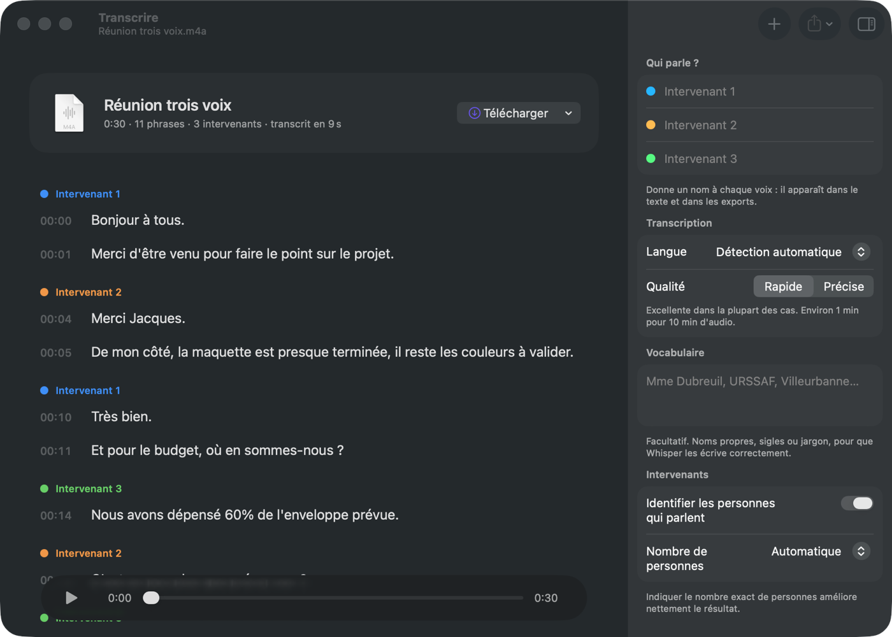

# Transcrire

App macOS qui retranscrit des fichiers audio et vidéo en texte, gratuitement et 100 % en local,
avec [Whisper](https://github.com/ml-explore/mlx-examples/tree/main/whisper) optimisé pour les puces Apple.



- un timecode par phrase ; un clic sur une phrase la fait écouter
- identification des personnes qui parlent (« Intervenant 1 », « Intervenant 2 »… renommables),
  avec [sherpa-onnx](https://github.com/k2-fsa/sherpa-onnx) et les modèles pyannote / WeSpeaker
- barre de progression, texte affiché au fil de l'eau, annulation
- réglages : langue, qualité (rapide / précise), vocabulaire à bien reconnaître, nombre de personnes
- export : texte, texte avec timecodes, sous-titres `.srt` — avec le nom de chaque intervenant

## Installation

Prérequis : Mac Apple Silicon sous macOS 26, outils en ligne de commande Xcode (`xcode-select --install`).

```bash
brew install ffmpeg uv
uv tool install mlx-whisper
./installer.sh        # construit Transcrire.app sur le Bureau
```

Au premier usage, le modèle Whisper (1,6 Go) et les outils d'identification des voix (≈ 60 Mo) se téléchargent.

## Fichiers

| Fichier | Rôle |
|---|---|
| `Transcrire.swift` | l'interface (SwiftUI) |
| `Moteur.swift` | lance `mlx_whisper` et `diarisation.py`, suit la progression, découpe en phrases, attribue chaque phrase à un intervenant |
| `diarisation.py` | repère qui parle quand (lancé via `uv`, qui installe ses dépendances tout seul) |
| `verifier.swift` | vérifications du moteur, lancées par `installer.sh` |
| `icone.swift` | dessine l'icône |
| `installer.sh` | vérifie, compile et assemble l'app — à relancer après chaque modification |
